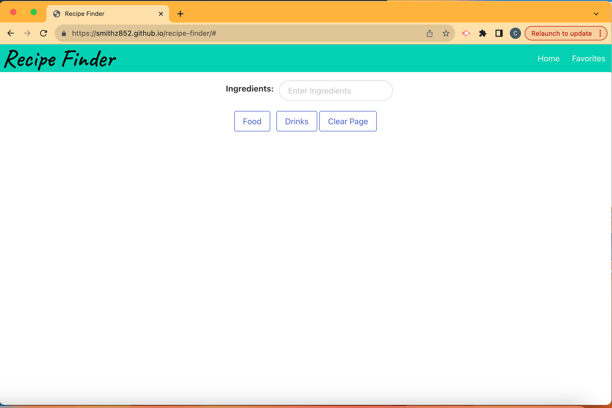

<Recipe-Finder>

# Description

The Recipe Finder web application is for user who wants to find food and alcoholic beverage recipes in one place. This will help users who have a lot of ingredients yet no recipes or guide on how to make a meal. The developers of this application gained skills and experience in web development such as using the Bulma CSS Framework, two different server-side APIs, and client-side storage to store data.

# Installation

To use the Recipe Finder, users should access the deployed link through their web browser. 

# Usage

To use the Recipe Finder, users should access the deployed link through their web browser. Next, users can input their ingredients into the form and then select for Food or Drinks recipes. 

Link to deployed application: https://smithz852.github.io/recipe-finder/# 

# Credits

Software Developers: 
- @smithz852
- @caaren10
- @ferewar

CSS Framework:
Bulma
- https://bulma.io/
- https://cdn.jsdelivr.net/npm/bulma@0.9.4/css/bulma.min.css

Server-side Application Programming Interface (APIs): 
- TheMealDB: https://www.themealdb.com/api.php https://www.themealdb.com/api/json/v1/1/filter.php?i=
- TheCocktailDB: https://www.thecocktaildb.com/api.php https://www.thecocktaildb.com/api/json/v1/1/search.php?s= 

# Features
- main 
- html-feature
- foodAPI
- styling-feature
- local-storage
- shorten-instructions
- clear-recipes
- style-feature
- moreStyles-feture
- recipe-css
- flex-update
- recipeCard-style
- cleanup
- README-feat

